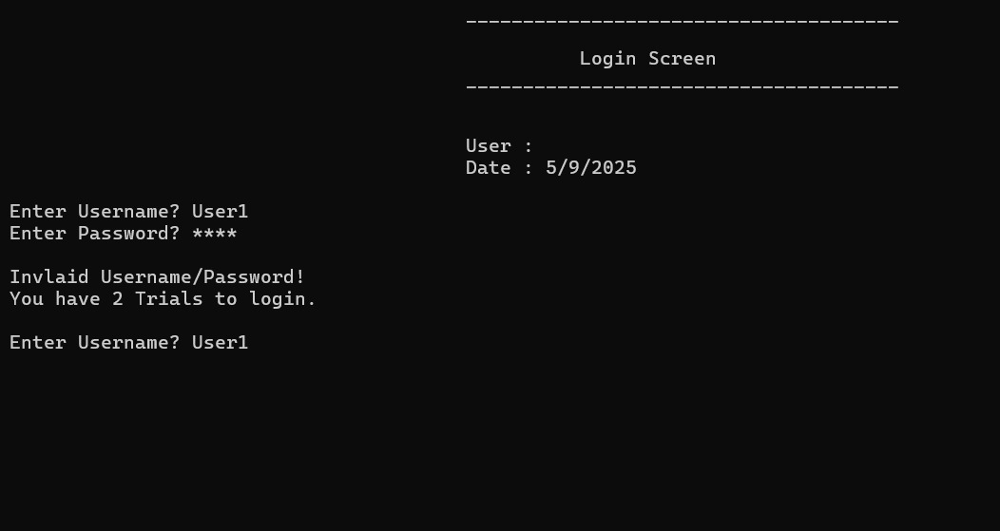
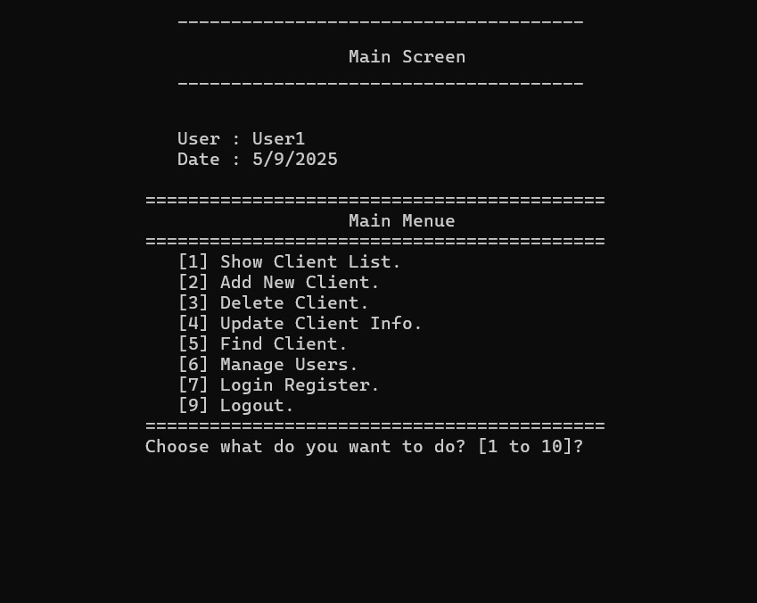
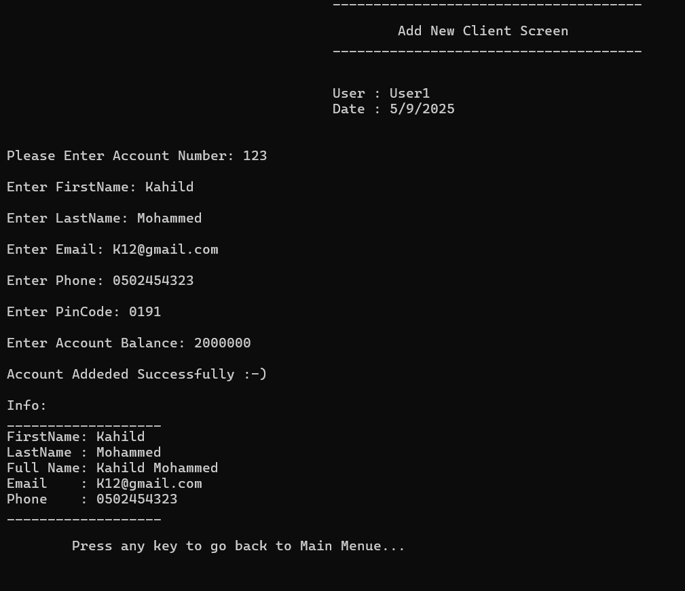
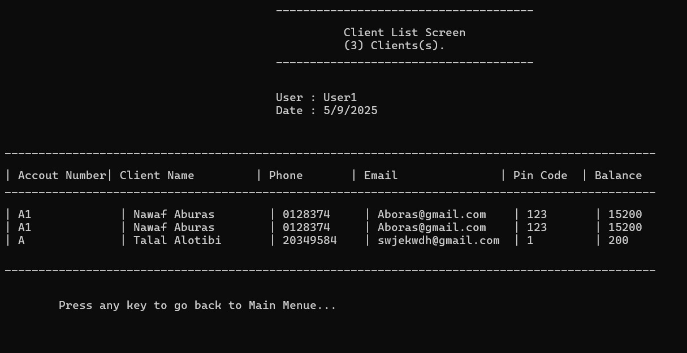

# Bank Management System

A complete **console-based banking system** developed entirely in **C++**.
The system simulates a real banking environment where users can manage client accounts, perform financial transactions, handle currency operations, and control system access through a secure authentication mechanism.

The project was built using **Object-Oriented Programming (OOP)** principles and modular design to simulate how a larger banking system might be structured.

All components — including authentication, transaction processing, file persistence, and system navigation — were implemented **from scratch without relying on third-party libraries**.

---

# Project Objective

The goal of this project was to practice building a **larger structured application in C++** while applying real-world software design principles.

Through this project, I practiced:

* Structuring a modular system
* Implementing a login and authentication system
* Managing client and user data
* Building multiple functional screens
* Handling file-based data persistence
* Designing reusable classes
* Implementing transaction logic
* Applying Object-Oriented Programming principles

This project helped me understand how to organize and build **larger and more complex systems** rather than simple standalone programs.

---

# Technologies Used

* **Language:** C++
* **Application Type:** Console Application
* **Architecture Style:** Object-Oriented Programming (OOP)
* **Data Storage:** Text files (File-based persistence)
* **IDE:** Visual Studio
* **Platform:** Windows Desktop (x64)

---

# System Features

The system includes several banking modules:

### Authentication

* Secure login system
* User authentication from file storage
* Role-based access control

### Client Management

* Add new clients
* Update client information
* Delete clients
* Search for clients
* View client list

### Financial Operations

* Deposit money
* Withdraw money
* Transfer funds
* View transfer logs
* View total balances

### Currency Management

* Currency list
* Currency exchange
* Currency calculator
* Update currency rates

### User Management

* Add users
* Update users
* Delete users
* View users list
* Manage user permissions

### System Utilities

* Input validation
* Date utilities
* String utilities
* Screen navigation system

---

# How to Run the Project

1. Download or clone the repository.

2. Open the project folder.

3. Open the solution file:

```
BankManagement_System.sln
```

4. The project will open in **Visual Studio**.

5. Run the program using:

```
Ctrl + F5
```

or press:

```
Local Windows Debugger
```

Opening the `.sln` file ensures that the **entire project structure loads correctly**.

---

# Login System

The system reads login credentials from the file:

```
Users.txt
```

User records are stored using a structured delimiter format.

Example record from the file:

```
User1#//#1234#//#123456#//#123456#//#User1#//#2345#//#-1
```

---

# Default Login Credentials

You can access the system using the following credentials:

```
Username: User1
Password: 1234
```

During login, the program reads the `Users.txt` file and validates the entered credentials against the stored user records.

If the credentials are correct, the user is granted access based on their defined permissions.

You can also modify the `Users.txt` file to create new users or change credentials.

---

# Data Storage

The system stores data using text files:

```
Clients.txt        → Client information
Users.txt          → System users and login credentials
Currencies.txt     → Currency data
LoginRegister.txt  → Login history
```

This approach simulates a simple persistence layer without requiring a database.

---

# Project Structure

```
Bank-Management-System/
│
├── BankManagement_System.sln
├── BankManagementSystem.vcxproj
│
├── Clients.txt
├── Users.txt
├── Currencies.txt
├── LoginRegister.txt
│
├── Main Screen.cpp
│
├── clsDate.h
├── clsPeriod.h
├── clsString.h
├── clsUtil.h
│
├── clsPerson.h
├── clsBankClient.h
├── clsUser.h
│
├── clsScreen.h
├── clsMainScreenOf_OOP11.h
│
├── clsAddNewClientScreen.h
├── clsDeleteClientScreen.h
├── clsUpdateClientScreen.h
├── clsFindClientScreen.h
├── clsClientListScreen.h
│
├── clsDepositClientScreen.h
├── clsWithdrawClientScreen.h
├── clsWireTransferClientScreen.h
├── clsTransferLogClientScreen.h
├── clsTotalBalancesClientScreen.h
│
├── clsCurrencyListScreen.h
├── clsFindCurrencyScreen.h
├── clsCurrencyCalculatorScreen.h
├── clsCurrencyExchangeScreen.h
├── clsUpdateCurrencyRateScreen.h
│
├── clsAddNewUserScreen.h
├── clsDeleteUserScreen.h
├── clsUpdateUserScreen.h
├── clsUsersListScreen.h
├── clsManageUsersScreen.h
│
├── clsLoginUsersScreen.h
├── clsLoginRegisterUsersScreen.h
│
├── Interfacecommunication.h
│
├── screenshots/
└── x64/
```

---

# Screenshots









---

# Notes

* The project focuses on **system design and logic rather than graphical interfaces**.
* All modules were implemented manually to better understand system structure.
* The system demonstrates how a **multi-module banking application** can be structured using C++.

---

## Developed By

Developed end-to-end by **Nawaf Altowairqi**

GitHub: [https://github.com/TheNawafTech](https://github.com/TheNawafTech)

---
